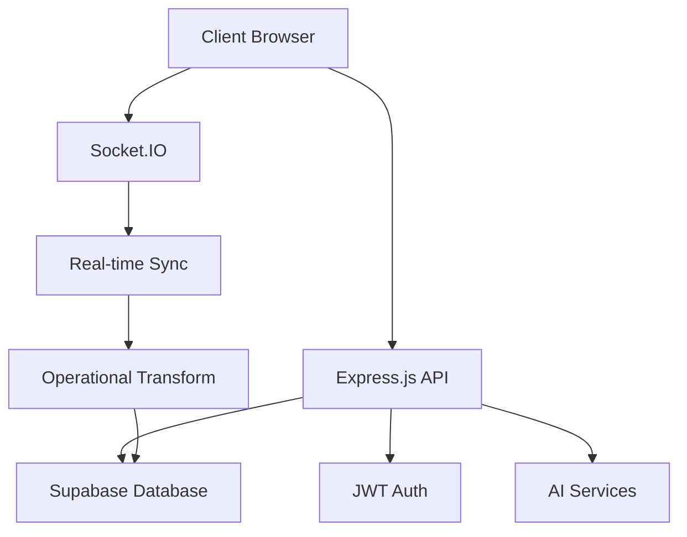

# 🎨 Real-time Collaborative Whiteboard

A modern, real-time collaborative whiteboard application where multiple users can draw, share ideas, and collaborate seamlessly. Built with cutting-edge technologies and AI-powered features.


## 🌟 **Features**

### ✅ **Implemented**
- **User Authentication** - JWT-based secure authentication
- **Room Management** - Create and join collaborative rooms
- **Database Integration** - Supabase PostgreSQL backend
- **RESTful API** - Complete backend API structure

### 🚧 **In Progress**
- **Real-time Drawing Sync** - Live collaboration with Socket.IO
- **Canvas Persistence** - Save and restore drawing sessions
- **User Presence** - See who's online and cursor positions

### 🎯 **Planned Features**
- **Conflict Resolution** - Handle simultaneous edits gracefully
- **AI Integration** - Shape recognition and handwriting-to-text
- **Offline Support** - Work offline and sync when reconnected
- **Export Options** - Save as PNG, PDF, SVG
- **MCP Server** - AI agent integration for smart features

## 🛠️ **Tech Stack**

### **Backend**
- **Node.js** - Runtime environment
- **Express.js** - Web framework
- **Supabase** - PostgreSQL database & authentication
- **Socket.IO** - Real-time communication
- **JWT** - Secure authentication tokens
- **bcryptjs** - Password hashing

### **Frontend** (Planned)
- **React/Vue.js** - UI framework
- **HTML5 Canvas** - Drawing interface
- **WebSocket** - Real-time updates

### **AI & ML**
- **OpenAI API** - Shape recognition & text conversion
- **Custom algorithms** - Operational transformation

## 🚀 **Quick Start**

### **Prerequisites**
- Node.js (v18 or higher)
- Supabase account
- Git

### **1. Clone Repository**
```bash
git clone https://github.com/your-username/real-time-collaborative-whiteboard.git
cd real-time-collaborative-whiteboard
```

### **2. Backend Setup**
```bash
cd backend
npm install
```

### **3. Environment Configuration**
```bash
# Copy environment template
cp .env.example .env

# Edit .env with your Supabase credentials
```

Required environment variables:
```env
PORT=5000
SUPABASE_URL=https://your-project-id.supabase.co
SUPABASE_ANON_KEY=your_anon_key
SUPABASE_SERVICE_ROLE_KEY=your_service_role_key
JWT_SECRET=your_super_secret_jwt_key_32_chars_minimum
```

### **4. Database Setup**
1. Create a [Supabase project](https://supabase.com)
2. Go to **SQL Editor** in your Supabase dashboard
3. Copy and run the contents of `backend/supabase-schema.sql`

### **5. Start Development Server**
```bash
# From backend directory
node src/index.js

# Or with npm script
npm run dev
```

### **6. Verify Setup**
Open your browser and test:
- Health Check: http://localhost:5000/api/health
- Auth Routes: http://localhost:5000/api/auth/health

**Expected Response:**
```json
{
  "status": "OK",
  "message": "Whiteboard API is running",
  "timestamp": "2026-01-31T...",
  "database": "Supabase PostgreSQL"
}
```

## 📁 **Project Structure**

```
real-time-collaborative-whiteboard/
├── README.md
├── backend/
│   ├── src/
│   │   ├── config/          # App configuration
│   │   ├── controllers/     # Route controllers
│   │   ├── database/        # Database connection
│   │   ├── middleware/      # Express middleware
│   │   ├── models/          # Data models
│   │   ├── routes/          # API routes
│   │   ├── services/        # Business logic
│   │   ├── utils/           # Utility functions
│   │   ├── app.js           # Express app setup
│   │   └── index.js         # Server entry point
│   ├── .env.example         # Environment template
│   ├── package.json         # Dependencies
│   └── supabase-schema.sql  # Database schema
└── frontend/                # Frontend app (planned)
    └── ...
```

## 🗃️ **Database Schema**

### **Tables**
- **users** - User accounts and authentication
- **rooms** - Collaborative whiteboard rooms
- **room_users** - User permissions in rooms
- **operations** - Drawing operations and history

### **Key Features**
- UUID primary keys
- Automatic timestamps
- Row Level Security (RLS)
- JSONB for flexible data storage
- Indexes for performance

## 🔌 **API Documentation**

### **Authentication Endpoints**
```http
POST /api/auth/register   # Create new user account
POST /api/auth/login      # User login
GET  /api/auth/health     # Auth system status
```

### **Planned Endpoints**
```http
# Room Management
POST /api/rooms           # Create new room
GET  /api/rooms/:id       # Get room details
POST /api/rooms/:id/join  # Join room

# Drawing Operations
POST /api/canvas/operation # Save drawing operation
GET  /api/canvas/:roomId   # Get canvas state
```

## 🏗️ **Architecture Overview**



## 👥 **Team Development**

### **Setup for New Team Members**
1. Clone the repository
2. Copy `.env.example` to `.env`
3. Get Supabase credentials from team lead
4. Run `npm install` in backend directory
5. Start development server
6. Join team Discord/Slack for coordination

### **Development Workflow**
```bash
# Daily routine
git pull                    # Get latest changes
npm install                # Install new dependencies
node src/index.js          # Start development server

# Before committing
npm test                   # Run tests (when implemented)
git add .
git commit -m "feat: implement user authentication"
git push
```

### **Environment Management**
- **Development**: Local development with Supabase cloud DB
- **Staging**: Shared staging environment for team testing
- **Production**: Live deployment (Vercel/Railway + Supabase)

## 🔧 **Development Commands**

```bash
# Backend Development
cd backend
npm install              # Install dependencies
npm run dev             # Start development server
npm test                # Run tests (planned)
npm run lint            # Code linting (planned)

# Database Operations
# Run in Supabase SQL Editor:
# - Copy contents of supabase-schema.sql
# - Execute to create/update tables
```

## 🌐 **Deployment**

### **Backend Deployment Options**
- **Railway** - Easy Node.js deployment
- **Vercel** - Serverless functions
- **Render** - Full-stack hosting
- **Fly.io** - Global app deployment

### **Database**
- **Supabase** - Managed PostgreSQL (recommended)
- Automatic backups and scaling
- Built-in authentication and real-time features

## 🤝 **Contributing**

1. Fork the repository
2. Create your feature branch (`git checkout -b feature/amazing-feature`)
3. Commit your changes (`git commit -m 'Add amazing feature'`)
4. Push to the branch (`git push origin feature/amazing-feature`)
5. Open a Pull Request

### **Code Standards**
- Use ES6+ JavaScript features
- Follow RESTful API conventions
- Write descriptive commit messages
- Add JSDoc comments for functions
- Implement error handling

## 🐛 **Troubleshooting**

### **Common Issues**

**❌ "Supabase connection failed"**
```bash
# Check your .env file has correct credentials
# Verify Supabase project is active
# Check network connectivity
```

**❌ "Module not found" errors**
```bash
# Ensure you're in the backend directory
cd backend
npm install
```

**❌ "Port 5000 already in use"**
```bash
# Change PORT in .env file
# Or kill the process using port 5000
```

## 📊 **Performance Metrics**

### **Target Performance**
- **API Response Time**: < 100ms
- **Real-time Latency**: < 50ms
- **Concurrent Users**: 100+ per room
- **Database Queries**: < 10ms average

### **Monitoring** (Planned)
- Real-time performance dashboards
- Error tracking and alerts
- User analytics and usage metrics

## 🔐 **Security**

### **Implemented**
- JWT token authentication
- Password hashing (bcrypt)
- CORS configuration
- Environment variable protection

### **Planned**
- Rate limiting per user/IP
- Input validation and sanitization
- XSS and CSRF protection
- Database Row Level Security (RLS)

## 📝 **License**

This project is licensed under the MIT License - see the [LICENSE](LICENSE) file for details.

## 🎯 **Roadmap**

### **Week 1** ✅
- [x] Project setup and basic backend
- [x] Supabase integration
- [x] User authentication foundation
- [x] API structure

### **Week 2** 🚧
- [ ] Socket.IO real-time communication
- [ ] Basic drawing operations
- [ ] Room management system
- [ ] Canvas persistence

### **Week 3** 🎯
- [ ] AI shape recognition
- [ ] Conflict resolution
- [ ] Export functionality
- [ ] Performance optimization

## 📞 **Support**

- Create an [Issue](https://github.com/your-username/real-time-collaborative-whiteboard/issues) for bug reports
- Join our [Discord](https://discord.gg/your-server) for discussions
- Check [Documentation](https://docs.your-project.com) for detailed guides

---

**Built with ❤️ by [Your Team Name]**

*Last updated: January 31, 2026*